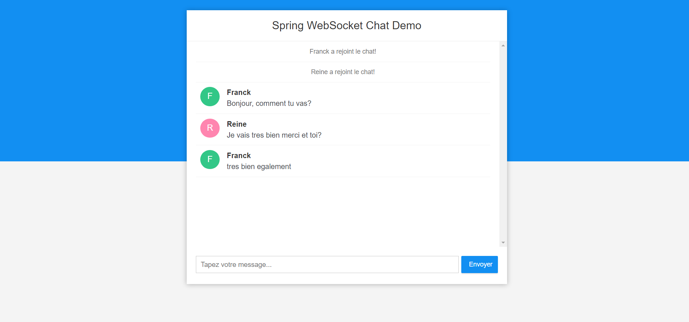

## Prérequis

1. Java - 1.8.x

2. Maven - 3.x.x

## Etapes d'installation

**1. Cloner le projet**

```bash
git clone https://github.com/callicoder/spring-boot-websocket-chat-demo.git
```

**2. Compiler et lancer le projet avec Maven**

```bash
cd spring-boot-websocket-chat-demo
mvn package
java -jar target/websocket-demo-0.0.1-SNAPSHOT.jar
```

Autre alternative, lancer le projet directement avec la commande qui suit -

```bash
mvn spring-boot:run
```


